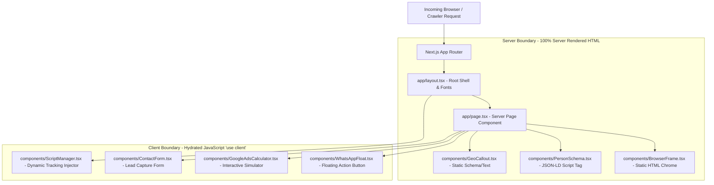
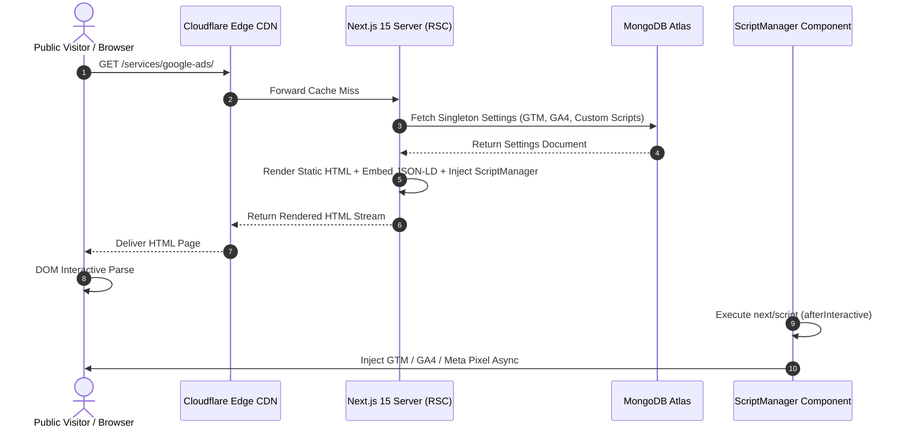
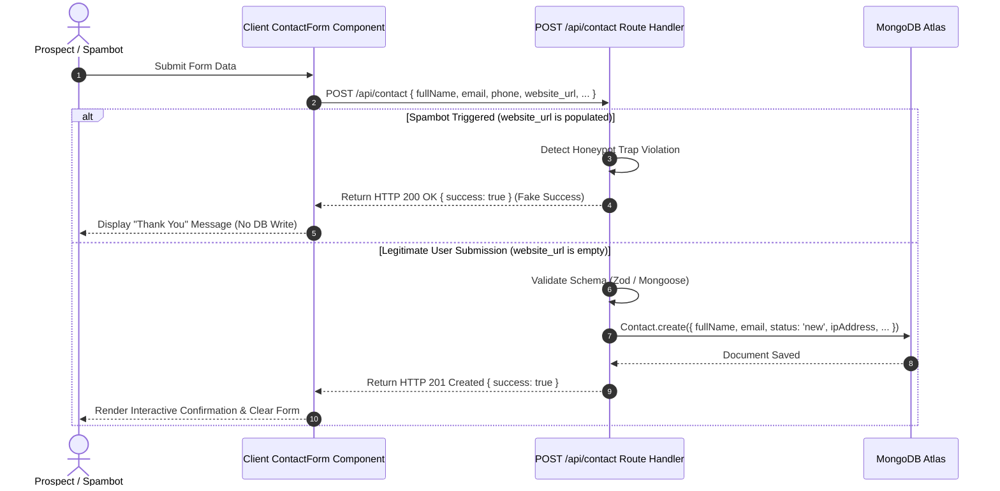
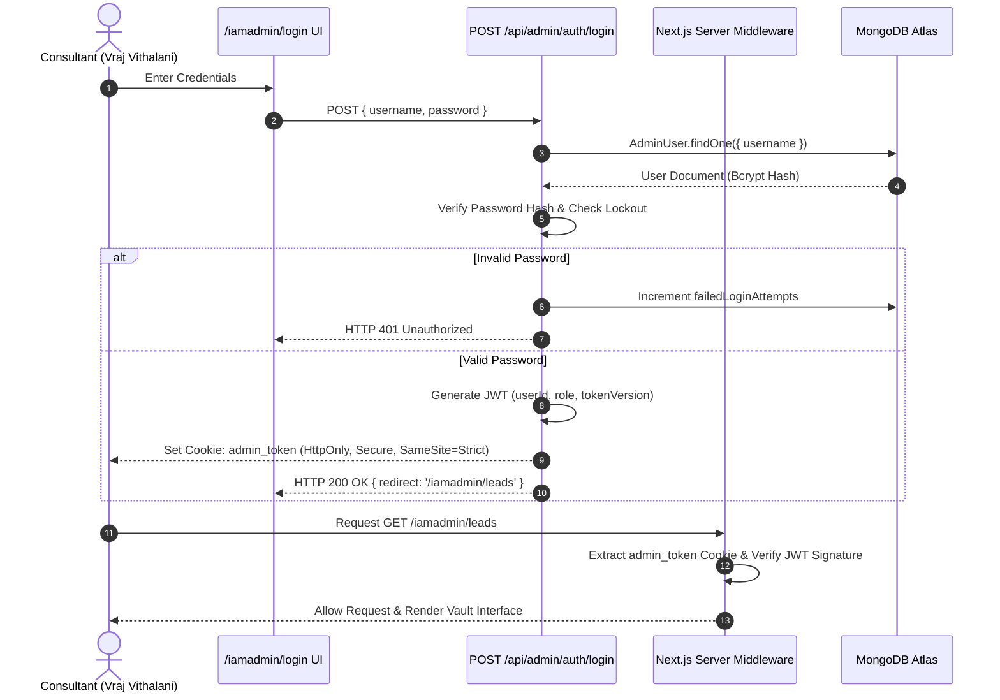
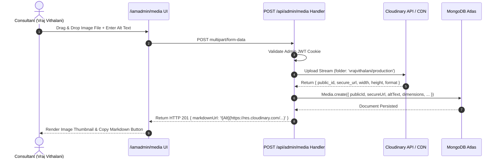
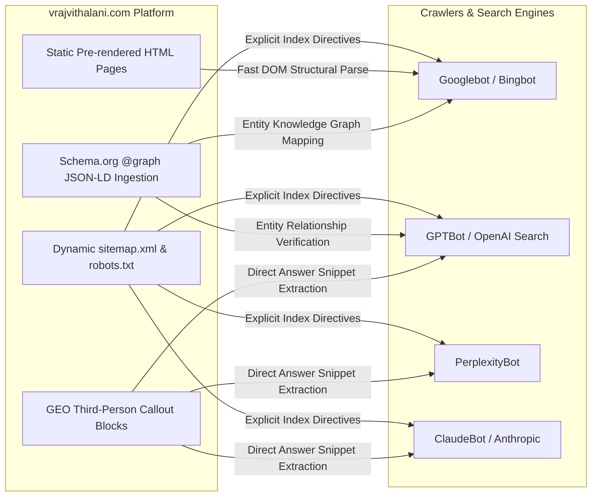

# 06 System Architecture & Component Data Flow Specification

## 1. Executive System Overview

`vrajvithalani.com` is engineered as a **hybrid Jamstack / Serverless Enterprise Web Platform** built on Next.js 15 (App Router), React 19, TypeScript, Tailwind CSS, and MongoDB Atlas. The system prioritizes sub-second page loads (Core Web Vitals 100/100 targets), zero layout shift, strict search engine & LLM crawler extraction (GEO), and isolated administrative data control.

```
+-----------------------------------------------------------------------------------+
|                                  EDGE LAYER                                       |
|                  Cloudflare Edge CDN / SSL / DNS Proxy / WAF                      |
+-----------------------------------------------------------------------------------+
                                         |
                                         v
+-----------------------------------------------------------------------------------+
|                              COMPUTE LAYER                                        |
|             Render Container / Vercel Serverless (Next.js 15 Engine)             |
|                                                                                   |
|  +---------------------------+  +-------------------+  +-----------------------+  |
|  | React Server Components   |  | API Route Handlers|  | Server Middleware     |  |
|  | (100% Static HTML / SSG)  |  | (REST Endpoints)  |  | (JWT Auth & Trailing) |  |
|  +---------------------------+  +-------------------+  +-----------------------+  |
+-----------------------------------------------------------------------------------+
                 |                         |                         |
                 v                         v                         v
+----------------------------------+ +-------------------+ +------------------------+
|       PERSISTENCE LAYER          | |   MEDIA ENGINE    | |    ANALYTICS ENGINE    |
|   MongoDB Atlas (Serverless DB)  | |   Cloudinary CDN  | | Dynamic Script Injection|
|  - Leads / Contacts Collection   | | (WebP Optimization| |  - GTM / GA4 / Pixel   |
|  - Settings Collection           | |   CDN Delivery)   | |  - Custom Head/Body JS  |
|  - Media Collection              | +-------------------+ +------------------------+
|  - AdminUser Collection          |
+----------------------------------+
```

---

## 2. Component Architecture (Server vs. Client Separation)

The application follows strict React Server Component (RSC) boundaries to ensure minimum client-side JavaScript bundle sizes.



### Component Responsibility Breakdown
1. **Server Components (RSC)**: Render all structural HTML, typography, long-form copy, case study data, service specs, and inline `<script type="application/ld+json">` tags. They execute exclusively on the server and ship zero JS runtimes for text content.
2. **Client Components (`'use client'`)**: Isolated interactive islands handling form state, input validation, math calculation, local storage interaction, and dynamic DOM script injection.

---

## 3. Request / Response Data Flow Sequences

### A. Public Page Visit & Dynamic Script Ingestion Flow
When a public user visits any route (`/`, `/services/google-ads/`, `/case-studies/drvishva/`), the system fetches administrative tracking settings without blocking core page rendering.



---

### B. Public Lead Capture & Honeypot Processing Flow
Handles public form submissions on `/contact/` and embedded service page CTA blocks with anti-spam traps.



---

### C. Admin Vault Authentication & Session Verification Flow
Governs access to encrypted administrative endpoints (`/iamadmin/*`).



---

### D. Cloudinary Media Manager Workflow
Governs drag-and-drop file uploads inside `/iamadmin/media/` for instant blog and case study Markdown insertion.



---

## 4. Search Engine & AI Crawler (GEO) Retrieval Architecture

To ensure dominant visibility across both traditional search engines (Google, Bing) and Generative AI engines (ChatGPT Search, Perplexity, Google AI Overviews, Claude), the system implements a dual-ingestion architecture.



### GEO Extraction Optimization Rules
1. **Third-Person Semantic Clarity**: Every GEO callout box explicitly states *"Vraj Vithalani is an independent computer engineer and digital marketing consultant based in Surat, Gujarat..."* so AI parsers attribute skills directly to the `#person` entity ID.
2. **Schema Entity Graphs**: Every page links its schema node back to `https://vrajvithalani.com/#person` under `author`, `publisher`, or `provider` properties.
3. **Robots.txt Directive Compliance**: AI crawlers (`GPTBot`, `PerplexityBot`, `ClaudeBot`) are explicitly granted `Allow: /` access while keeping administrative paths (`Disallow: /iamadmin/`, `Disallow: /api/admin/`) strictly private.

---

## 5. System Infrastructure & Host Topology

```
                                  +-----------------------+
                                  |   Cloudflare Edge     |
                                  | DNS / SSL / WAF Proxy |
                                  +-----------+-----------+
                                              |
                                              v
                                  +-----------------------+
                                  | Render / Vercel Host  |
                                  | Next.js App Server    |
                                  +-----+-----------+-----+
                                        |           |
                     +------------------+           +------------------+
                     |                                                 |
                     v                                                 v
        +-------------------------+                       +-------------------------+
        |   MongoDB Atlas DB      |                       |   Cloudinary Asset CDN  |
        | Serverless Cluster      |                       | Media Delivery Network  |
        | - Leads Collection      |                       | - Blog Images           |
        | - Settings Collection   |                       | - Screenshots           |
        | - Media Collection      |                       | - Auto WebP Transform   |
        | - AdminUser Collection  |                       +-------------------------+
        +-------------------------+
```

### Infrastructure Configuration Standards
* **Hosting Platform**: Render / Vercel Serverless Node.js runtime.
* **Database**: MongoDB Atlas M0/Serverless Cluster with TLS encrypted connections.
* **Media Delivery**: Cloudinary CDN with automatic WebP conversion and adaptive image quality.
* **DNS & Security Proxy**: Cloudflare Free/Pro Proxy tier handling SSL termination, HTTP/3 delivery, and rate limiting.
