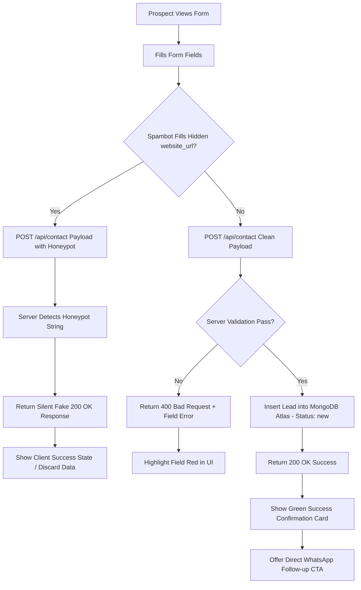
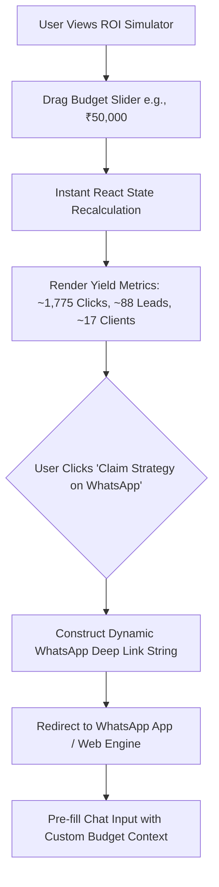
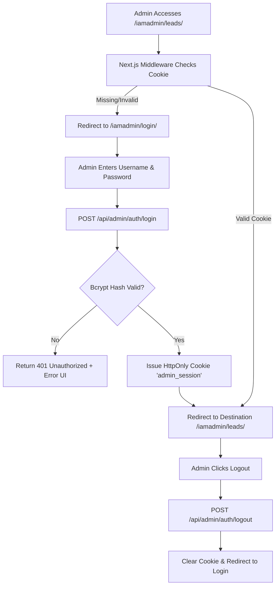
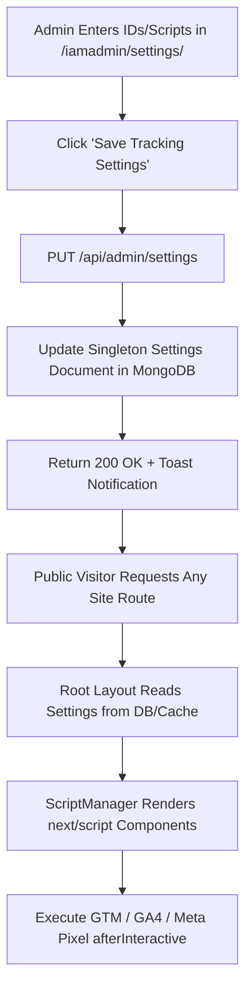
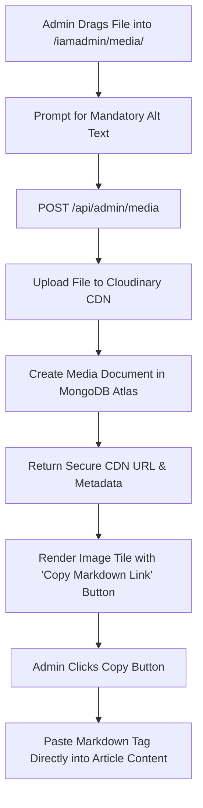

# 10 User Flow Diagrams & Navigation Paths

## 1. Document Overview & User Flow Methodology
This document defines the step-by-step navigation paths, decision trees, state transitions, and textual/Mermaid flowcharts for all primary interactions on `vrajvithalani.com`. These flows guarantee zero UX friction, non-blocking asynchronous tracking, robust spambot rejection, and high-converting lead journeys for both public users and the administrator.

---

## 2. Flow 1: Public Inbound Lead Capture & Honeypot Filtering Flow

### 2.1 Narrative Description
1. **Entry**: Prospect visits any commercial page (e.g., Homepage `/`, Service Pillar `/services/google-ads/`, or Location page `/locations/surat/`) and clicks "Get Free Audit" or scrolls to the `#contact` section.
2. **Form Interaction**: Prospect enters `fullName`, `email`, `phone`, selects `service`, chooses `monthlyBudget`, types a custom `message`, and submits.
3. **Hidden Honeypot Check**: An invisible input field `website_url` (hidden via CSS `-top-[9999px]`) exists in the DOM.
   - **Path A (Spambot Triggered)**: Spambots automatically populate all visible and hidden form fields. If `website_url` contains any string, the client POST request proceeds, but the server API silently returns `200 OK` ("Thank you for reaching out") while discarding the data without saving it to MongoDB Atlas or firing notification alerts.
   - **Path B (Valid Human User)**: `website_url` remains empty. Server validates input formats, saves the lead to MongoDB under status `new`, fires webhook notifications, and returns `200 OK`.
4. **Client Confirmation**: The form UI transforms into a green success card displaying a personalized confirmation message with a 24-hour response SLA.

### 2.2 Mermaid Flowchart Diagram

### 2.3 State Transition Table
| Trigger | Initial State | Validation / Logic Check | Resulting State | User / System Output |
| :--- | :--- | :--- | :--- | :--- |
| **Form Submit** | Empty / Editing | Client validation (Email regex, Phone length) | Validating | Disable button, show loading spinner |
| **Client Error** | Validating | Invalid email format or missing phone | Edit Mode | Highlight red inputs, inline message |
| **Bot Submit** | Validating | `website_url` is non-empty | Fake Success | Fake green message, zero DB write |
| **Server Success** | Validating | Valid fields, empty `website_url` | Submitted | Render success card, write DB record |

---

## 3. Flow 2: Interactive Google Ads ROI Simulator & Conversion Flow

### 3.1 Narrative Description
1. **Entry**: Prospect navigates to `/services/google-ads/` and scrolls to the interactive ROI Simulator component (`GoogleAdsCalculator.tsx`).
2. **Slider Adjustment**: User adjusts the Monthly Ad Budget slider (range: ₹15,000 to ₹500,000).
3. **Real-time Recalculation**: On slider movement, client-side React state instantly updates math models without page reloads:
   - Estimated Clicks = Budget / ₹28.17 (Benchmark CPC)
   - Estimated Inquiries = Clicks × 5.0% Conversion Rate
   - Projected Customers = Inquiries × 20.0% Sales Close Rate
4. **WhatsApp Conversion CTA**: The user clicks the pre-configured "Claim This Strategy on WhatsApp" button.
5. **Deep Link Handoff**: Opens `https://wa.me/919909918231` with pre-filled text: `"Hi Vraj, I calculated an ad budget of ₹[BUDGET] on your website simulator and would like to discuss achieving ~[LEADS] qualified leads."`

### 3.2 Mermaid Flowchart Diagram

---

## 4. Flow 3: Admin Vault Authentication, Middleware Guard & Logout Flow

### 4.1 Narrative Description
1. **Protected Route Access**: Administrator navigates directly to `/iamadmin/leads/`.
2. **Next.js Middleware Execution**: `middleware.ts` intercepts the request and inspects incoming HTTP cookies for `admin_session`.
   - **Path A (Missing / Expired Token)**: Middleware redirects request to `/iamadmin/login/` with `?redirect=/iamadmin/leads/`.
   - **Path B (Valid Signed Token)**: JWT signature and `tokenVersion` validated; page renders instantly.
3. **Login Action**: Admin submits credentials on `/iamadmin/login/`. API checks Bcrypt password hash against MongoDB `AdminUser` model. Upon verification, sets an `HttpOnly`, `Secure`, `SameSite=Strict` cookie containing the JWT session.
4. **Logout Action**: Admin clicks "Logout" in admin header. Client fires `POST /api/admin/auth/logout`, server clears cookie (`Max-Age=0`), and redirects user to `/iamadmin/login/`.

### 4.2 Mermaid Flowchart Diagram

---

## 5. Flow 4: Dynamic Analytics & Tracking Script Injection Flow

### 5.1 Narrative Description
1. **Configuration**: Admin logs into `/iamadmin/settings/`.
2. **Script Management**: Admin updates GTM ID (`GTM-XXXXX`), GA4 ID (`G-XXXXX`), Meta Pixel ID (`123456789`), or pastes a custom script snippet into the `<head>` or `<body>` textarea fields.
3. **Persist Settings**: Admin clicks "Save Tracking Settings". Fires `PUT /api/admin/settings`. MongoDB Atlas updates the singleton settings document.
4. **Client Layout Ingestion**: Next time a public visitor loads any page, root layout (`app/layout.tsx`) calls `getSettings()`. `ScriptManager.tsx` uses `next/script` with `strategy="afterInteractive"` to inject all active scripts dynamically without breaking SSR or slowing core Web Vitals.

### 5.2 Mermaid Flowchart Diagram

---

## 6. Flow 5: Admin Cloudinary Media Upload & Blog Markdown Insertion Flow

### 6.1 Narrative Description
1. **Asset Upload**: Admin opens `/iamadmin/media/` and drags a browser dashboard screenshot (`seo-audit.png`) into the upload zone.
2. **Cloudinary Ingestion**: Client sends multipart form data to `POST /api/admin/media`. Server uploads asset to Cloudinary folder `/vrajvithalani/production/` with `f_auto,q_auto` transformation options.
3. **Metadata Storage**: Server creates a `Media` record in MongoDB saving `publicId`, `secureUrl`, width, height, format, and user-provided `altText`.
4. **1-Click Copy**: Admin clicks "Copy Markdown Link" on the generated media tile. The clipboard receives ``.
5. **Content Insertion**: Admin opens long-form article draft in `/learn/` or case study Markdown document and pastes the link directly into content.

### 6.2 Mermaid Flowchart Diagram

---

## 7. Summary & Phase 2 Completion Matrix
With the publication of **File #10**, Phase 2 (Product Logic & Architecture) is now **100% Complete**.

| File | Title | Phase | Status |
| :--- | :--- | :---: | :---: |
| **06** | `06_system_architecture_diagram.md` | Phase 2 | **Complete** |
| **07** | `07_functional_requirements_frd.md` | Phase 2 | **Complete** |
| **08** | `08_non_functional_requirements.md` | Phase 2 | **Complete** |
| **09** | `09_user_stories_and_acceptance_criteria.md` | Phase 2 | **Complete** |
| **10** | `10_user_flow_diagrams.md` | Phase 2 | **Complete** |
